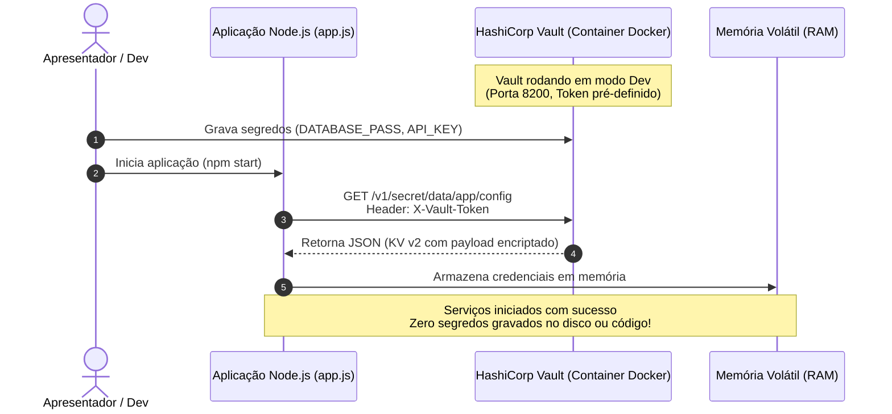

# 🔐 Gerenciamento de Segredos com HashiCorp Vault e Node.js

Demonstração prática e acadêmica do desacoplamento de credenciais e eliminação do anti-padrão de **Hardcoding**, utilizando injeção dinâmica de segredos em tempo de execução via **HashiCorp Vault**.

---

## 🎯 Objetivo Didático

Este projeto tem como meta ilustrar para bancas avaliadoras e estudantes de Engenharia de Software e Segurança da Informação:
1. **O Anti-padrão (Hardcoding):** Os riscos de salvar senhas, chaves de API e tokens diretamente no código-fonte ou em arquivos versionados (Git).
2. **O Padrão Recomendado (Zero-Trust / Dynamic Secrets):** Como desacoplar completamente o código da configuração sensível, consultando o cofre de segredos em tempo de execução e mantendo as credenciais estritamente em **memória volátil (RAM)**.
3. **Rotação Transparente:** Capacidade de alterar credenciais no cofre sem necessidade de alterar o código ou realizar novo *deploy* da aplicação.

---

## 🏛️ Arquitetura da Solução



---

## 📋 Pré-requisitos

- [Docker](https://www.docker.com/) instalado e em execução.
- [Node.js](https://nodejs.org/) (versão 18 ou superior).
- [npm](https://www.npmjs.com/) (gerenciador de pacotes).

---

## 🚀 Passo a Passo: Configuração do Ambiente

### 1. Subir o HashiCorp Vault via Docker

Execute o comando abaixo no terminal para inicializar um container oficial do Vault em **modo de desenvolvimento** (`-dev`), com a porta `8200` exposta e um token *root* pré-configurado:

```bash
docker run -d --name vault-demo \
  -p 8200:8200 \
  -e 'VAULT_DEV_ROOT_TOKEN_ID=my-root-token' \
  -e 'VAULT_DEV_LISTEN_ADDRESS=0.0.0.0:8200' \
  hashicorp/vault:latest
```

> **Nota:** O modo de desenvolvimento (`-dev`) inicializa o Vault já destravado (*unsealed*) e com o motor de segredos Key-Value v2 montado automaticamente no caminho `secret/`.

---

### 2. Cadastrar os Segredos de Demonstração no Vault

Você pode configurar os segredos diretamente pelo terminal utilizando o CLI do próprio container do Vault:

```bash
docker exec -it vault-demo vault kv put secret/app/config \
  DATABASE_PASS="SuperSegredoDB2026!" \
  API_KEY="sk_live_hashicorp_academico_847291"
```

#### Para auditar e visualizar o segredo gravado via CLI:
```bash
docker exec -it vault-demo vault kv get secret/app/config
```

#### 🌐 (Opcional - Visual para Apresentação): Interface Web do Vault
Abra o navegador em: [http://localhost:8200](http://localhost:8200)
- **Method:** `Token`
- **Token:** `my-root-token`
- Navegue até `secret/` -> `app/` -> `config` para mostrar visualmente a interface gerencial para a turma e o professor.

---

### 3. Instalar as Dependências da Aplicação Node.js

No diretório raiz do projeto, instale os pacotes definidos no `package.json`:

```bash
npm install
```

---

### 4. Executar a Aplicação Node.js

Inicie o script:

```bash
npm start
```

Você verá a saída demonstrando:
- A conexão HTTP autenticada via cabeçalho `X-Vault-Token`.
- O consumo do endpoint REST Key-Value v2 (`/v1/secret/data/app/config`).
- A injeção em memória e o mascaramento seguro dos segredos obtidos.

---

## 🎤 Roteiro Sugerido para Apresentação ao Vivo (5 a 10 minutos)

1. **Abertura (O Problema):**
   - Abra o arquivo [app.js](file:///c:/Users/yvict/dev/HashCorp/app.js) e aponte para o cabeçalho de comentário demonstrando o que é **Hardcoding** (CWE-798 / OWASP Top 10 A07).
   - Explique que comitar segredos no Git expõe a infraestrutura a vazamentos catastróficos.

2. **A Solução (Vault):**
   - Mostre o container Docker em execução (`docker ps`).
   - Acesse a interface web em [http://localhost:8200](http://localhost:8200) e mostre onde os segredos ficam criptografados.

3. **Execução ao Vivo:**
   - Execute `npm start` no terminal e mostre a aplicação recuperando os dados dinamicamente.

4. **Demonstração do "Efeito Uau" (Rotação Sem Rebuild):**
   - Sem parar o Node.js nem alterar uma única linha de código, rode no terminal:
     ```bash
     docker exec -it vault-demo vault kv put secret/app/config DATABASE_PASS="NovaSenhaRotacionada999!" API_KEY="sk_live_nova_chave"
     ```
   - Execute novamente `npm start`.
   - **Conclusão:** Mostre que a aplicação já lê a nova versão do segredo (`v2`), provando que a rotação de senhas foi desacoplada do ciclo de vida da aplicação!

---

## 🛡️ Tratamento de Erros e Resiliência

Caso a aplicação encontre problemas de conectividade, ela possui tratamento especializado:
- **Vault Desligado (`ECONNREFUSED`):** Mensagem orientando a iniciar o container Docker.
- **Token Inválido (`403 Forbidden`):** Alerta sobre credenciais expiradas ou insuficientes.
- **Caminho Inexistente (`404 Not Found`):** Alerta indicando que o segredo não foi gravado no caminho esperado.

---

## 🏭 Considerações de Segurança para Ambientes de Produção

Em ambientes corporativos e de alta maturidade em nuvem (AWS, GCP, Kubernetes), adotam-se extensões desse padrão:
1. **Identidade de Máquina (Machine Identity):** Em vez de token fixo, utiliza-se **Vault AppRole**, **Kubernetes ServiceAccount** ou **AWS IAM** para autenticação automática e efêmera.
2. **Vault Agent / Sidecar Injector:** Em clusters Kubernetes, utiliza-se o Vault Agent como sidecar para injetar os segredos em `/vault/secrets/` sem que a aplicação precise sequer chamar a API diretamente via código.
3. **Segredos Dinâmicos (Dynamic Secrets):** O Vault pode criar credenciais de banco de dados temporárias com TTL (ex: válidas por apenas 1 hora) e revogá-las automaticamente.